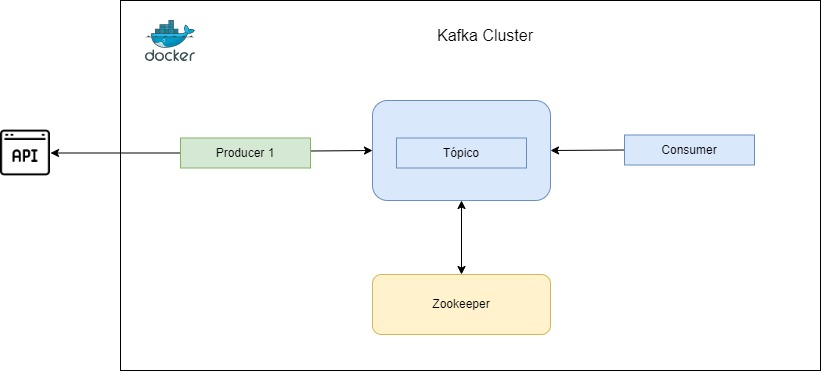

# MBA Engenharia de Dados - Mackenzie

### Data Storage Collection

#### Projeto Prático da disciplina:

Desenvolver um projeto de coleta de dados e armazenamento contendo uma fonte de dados (evento, pdf, imagem, vídeo, office) utilizando uma ferramenta de streaming (Kafka ou Event Hub) e armazenamento local ou em nuvem.
Você pode desenvolver Open Source, Microsoft Azure ou AWS.

Entrega:
- 1 - Sistema funcionando
- 2 - Desenho da Arquitetura do sistema 
- 3 - Proposta de solução com vantagens e benefícios em comparação com as outras opções 
- 4 - Manual do sistema contendo passo a passo para o desenvolvimento, explicação das ferramentas e da tecnologia utilizada
- 5 - Apresentação em sala de aula

Será avaliado cada item da entrega para compor a nota do projeto.

## 1 - Sistema funcionando
Para executar o sistema é necessárioa ter os seguintes recursos:

- [WSL - Linux](https://learn.microsoft.com/pt-br/windows/wsl/about)
- [Docker](https://docs.docker.com/get-started/docker-overview/)
- [Confluent-kafka Lib](https://pypi.org/project/confluent-kafka/)
- [Request Lib](https://pypi.org/project/requests/)

## 2 - Desenho da Arquitetura do sistema

- 2.1 Arquitetura do ambiente de execução
    

- 2.2 Arquitetura Cluster Kafka

## 3 Proposta de Solução
A solução utiliza Kafka para streaming de dados, junto com AWS, Docker, Zookeeper e WSL.

### Kafka vs. Azure Event Hub
1. **Open-source vs. Serviço Gerenciado**:
   - Kafka é uma solução open-source, que pode ser hospedada em qualquer infraestrutura, seja on-premise ou em nuvem, oferecendo flexibilidade e controle total sobre o ambiente.
   - Azure Event Hub é um serviço gerenciado, o que simplifica a configuração e o gerenciamento, mas reduz o controle e pode gerar custos adicionais a longo prazo.
   
2. **Escalabilidade**:
   - Kafka é conhecido por sua alta capacidade de escalabilidade horizontal (aumentar o desempenho de um sistema adicionando mais máquinas (ou servidores) à infraestrutura existente), sendo amplamente utilizado em cenários de Big Data e sistemas que exigem grande volume de eventos em tempo real.
   - Event Hub também oferece escalabilidade, mas o Kafka se destaca em soluções onde o controle sobre a infraestrutura e a retenção de dados são cruciais.
   
3. **Retenção de Dados**:
   - Kafka permite a retenção de mensagens por períodos flexíveis e longos, o que é ideal para cenários onde os dados precisam ser reprocessados ou consultados após longos intervalos.
   - Event Hub tem limitações em termos de retenção de dados (geralmente até 7 dias, dependendo do plano), o que pode ser um ponto de limitação para certas aplicações.
   
4. **Custo**:
   - Kafka pode ser mais econômico em ambientes controlados ou com volumes muito grandes de dados, já que a solução open-source não possui custos de licenciamento diretos.
   - Event Hub tem um custo mais previsível, mas pode se tornar mais caro em soluções que exigem retenção prolongada ou processamento intensivo.

### Benefícios Gerais
- **Zookeeper**:
   - **Coordenação distribuída**: Gerencia serviços distribuídos, como o Kafka, garantindo que o cluster funcione de forma coesa.
   - **Alta disponibilidade**: Suporta recuperação automática de falhas e garante que o sistema esteja sempre sincronizado.
   
- **WSL (Windows Subsystem for Linux)**:
   - **Eficiência de recursos**: Executa Linux diretamente no Windows sem necessidade de VMs, economizando memória e processamento.
   - **Integração simplificada**: Permite usar ferramentas e fluxos de trabalho Linux no ambiente Windows, facilitando o desenvolvimento.
   
- **Docker**:
   - **Portabilidade**: "Containeriza" aplicações, garantindo que elas rodem em qualquer ambiente sem problemas de compatibilidade.
   - **Desenvolvimento rápido**: Facilita o gerenciamento de dependências e ambientes, acelerando o ciclo de desenvolvimento e teste.

### Conclusão
A escolha por Kafka oferece maior controle, flexibilidade e escalabilidade, além de ser uma solução mais vantajosa em termos de retenção de dados e custos a longo prazo, especialmente para grandes volumes de dados. Event Hub simplifica a gestão, mas pode ser mais limitado em cenários complexos. Além disso, o uso de Zookeeper proporciona coordenação eficiente e alta disponibilidade em sistemas distribuídos, WSL otimiza recursos e facilita o uso de ferramentas Linux no Windows, e Docker garante portabilidade e acelera o desenvolvimento, proporcionando um ambiente mais ágil e flexível para implantação.

## 4 - Manual do sistema contendo passo a passo para o desenvolvimento, explicação das ferramentas e da tecnologia utilizada

A aplicação funciona da seguinte forma:

Utilizamos os seguintes recursos para confecção desse trabalho: Docker, Kafka e Zookeeper.

#### 1. Docker [(Documentação do Docker)](https://docs.docker.com/): 
Docker é um conjunto de produtos de plataforma como serviço que usam virtualização de nível de sistema operacional para entregar software em pacotes chamados contêineres. Os contêineres são isolados uns dos outros e agrupam seus próprios softwares, bibliotecas e arquivos de configuração.

#### 2. Kafka [(Documentação do Kafka)](https://kafka.apache.org/20/documentation.html): 
Apache Kafka é um armazenamento de dados distribuído otimizado para ingestão e processamento de dados de streaming em tempo real. Dados de transmissão são dados gerados continuamente por milhares de fontes de dados, que normalmente enviam os registros de dados simultaneamente. Uma plataforma de transmissão precisa lidar com esse fluxo constante de dados e processá-los de forma sequencial e incremental.

#### 3. Zookeeper [(Documentação do Zookeeper)](https://zookeeper.apache.org/doc/r3.9.2/index.html):
Zookeeper é um serviço centralizado que fornece serviços de grupo, nomeação, sincronização distribuída e mantém informações de configuração. O Apache ZooKeeper usa o Apache log4j como infraestrutura de registro

## 5 - Apresentação em sala de aula

